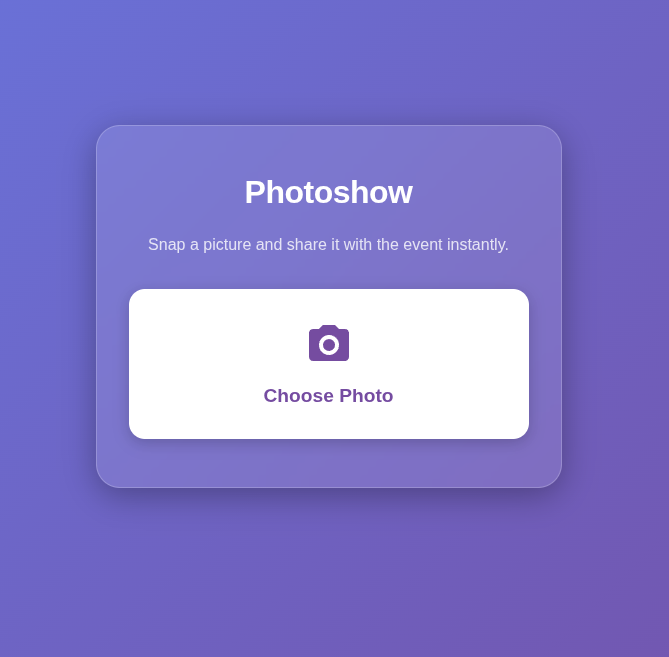
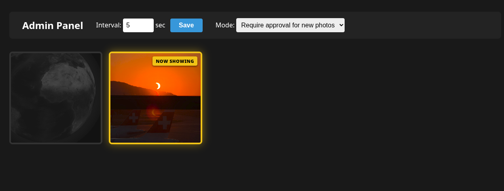
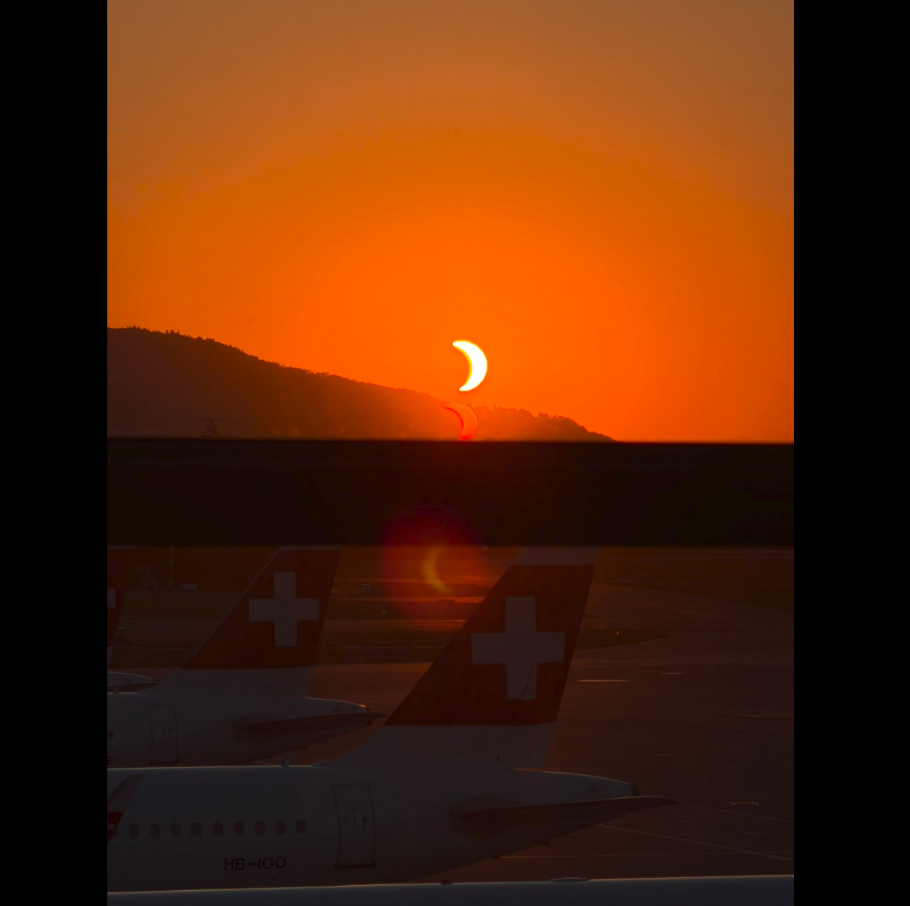

# **📸 Photoshow**

A lightweight, zero-dependency Live Photo Show server written in Go. It runs as a single binary on Windows, macOS, or Linux, or inside an all-in-one Tailscale-enabled Docker container.

Guests can upload photos from their phones, and the photos instantly appear on a live presentation screen. It includes a built-in admin panel to moderate photos and adjust display settings on the fly.

## **✨ Features**

* **Zero Dependencies:** Compiles to a single binary with all HTML/JS embedded.  
* **Instant Sync:** New uploads instantly jump to the screen without waiting.  
* **Admin Moderation:** One-click approve/deny photos in real-time.  
* **Two Modes:** Choose between "Auto-allow" or "Require approval" for new uploads.  
* **Dual-Port Security:** Public uploads run on port 8080, while the private presentation and admin panel run on port 8081\.

## **🚀 Demo**

### **Upload Screen (Mobile)**

> 

### **Admin Panel**

> 

### **Live Display**

> 

## **🛠 Getting Started**

The server runs on two separate ports to keep your admin tools secure:

* **Upload Page (Public):** http://localhost:8080/  
* **Live Display (Private):** http://localhost:8081/show  
* **Admin Panel (Private):** http://localhost:8081/admin


### **Option A: All-in-One Docker Container (Tailscale Built-in)**

You can run Photoshow using the pre-built image from your GitHub Container Registry, which has Tailscale baked right in. It uses a Docker volume to persist your Tailscale certificates and state across restarts.

#### **1\. Run the Container**

To allow Tailscale to create a virtual network interface inside Docker, include `--cap-add=NET_ADMIN` and `--device=/dev/net/tun`
```
docker run -d \
  --name photoshow \
  --cap-add=NET_ADMIN \
  --cap-add=NET_RAW \
  -p 8080:8080 \
  -p 8081:8081 \
  -v $(pwd)/uploads:/app/uploads \
  -v tailscale_state:/var/lib/tailscale \
  ghcr.io/georgesoteriou/photo_show:latest
```

#### **2\. Authenticate Tailscale via Logs**

Because this setup does not use auth keys, check your container logs to authenticate the node:
```
docker logs -f photoshow
```
The logs will output a login URL (e.g., https://login.tailscale.com/a/...). Open that link in your browser, log in, and approve the new node. Once approved, the container will automatically boot up the funnel and provide your secure public upload URL\!

### **Option B: Standalone Binary & Tailscale Script**

Download or compile the binary for your OS and execute it:
```
./photoshow
```
To expose the public upload port (8080) securely via Tailscale, use the provided `start_network.sh` script:
```
chmod +x start_network.sh  
./start_network.sh
```

## **💻 Building from Source**

To compile the application yourself, you need [Go](https://go.dev/) installed:

### **Windows**
```
GOOS=windows GOARCH=amd64 go build -o photoshow.exe main.go
```
### **macOS**
```
# Apple Silicon (M1/M2/M3/M4)  
GOOS=darwin GOARCH=arm64 go build -o photoshow-mac-arm64 main.go

# Intel Macs  
GOOS=darwin GOARCH=amd64 go build -o photoshow-mac-intel main.go
```
### **Linux**
```
GOOS=linux GOARCH=amd64 go build -o photoshow-linux-amd64 main.go  
```